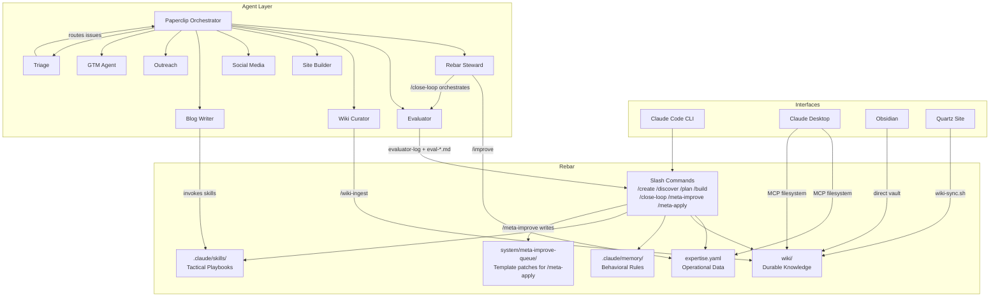
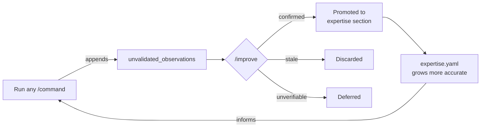
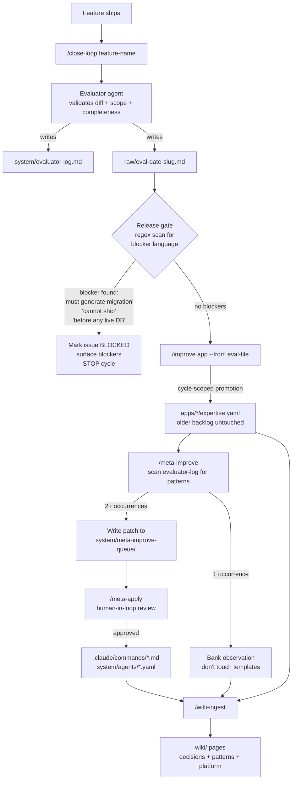
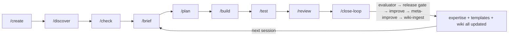
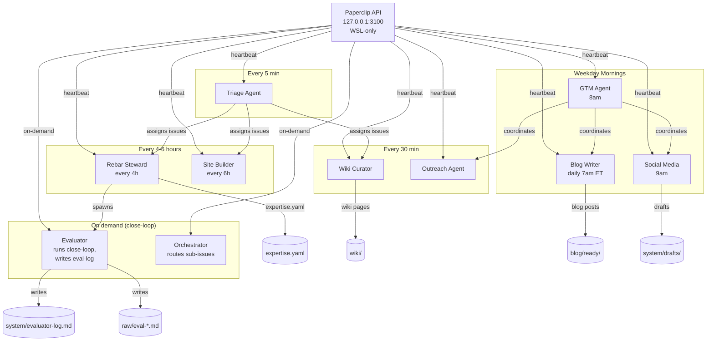

# Architecture Diagrams

Visual overview of how the Rebar components connect.

## Overall Architecture

## Self-Learn Loop (per-observation)

Every slash command appends raw observations. The `/improve` command validates each one against current state and either promotes it into the relevant section, discards it, or defers it for later verification.

## Close-Loop Harness (per-feature)

The harness runs after every shipped feature. Four gates, each feeds the next.

Order is load-bearing. `/wiki-ingest` runs last so it captures meta-improve artifacts alongside eval findings. The release gate blocks bad ships — the piece missing from most agent loops. Pattern rule is "2+ occurrences = act, 1 = bank and don't touch the template." Subtraction over addition.

## Four Knowledge Systems

```mermaid
graph TB
    subgraph "expertise.yaml"
        E1[Project state]
        E2[API gotchas]
        E3[Build results]
        E4[Known limitations]
    end

    subgraph ".claude/memory/"
        M1[User preferences]
        M2[Process rules]
        M3[Guardrails]
        M4[Behavioral patterns]
    end

    subgraph ".claude/skills/"
        S1[content-strategy]
        S2[content-production]
        S3[content-humanizer]
        S4[ai-seo + copywriting + launch-strategy]
    end

    subgraph "wiki/"
        W1[Reusable patterns]
        W2[Architectural decisions]
        W3[Platform knowledge]
        W4[People and roles]
    end

    CMD2[Slash Commands] -->|structured YAML| E1
    AUTO[Claude automatically] -->|markdown + frontmatter| M1
    UPSKILL[scripts/update-skills.sh] -->|from claude-skills upstream| S1
    WCMD[Wiki Commands] -->|Obsidian markdown| W1

    E1 -.->|runtime data| SESSION[Current Session]
    M1 -.->|behavioral rules| SESSION
    S1 -.->|tactical playbooks| SESSION
    W1 -.->|durable knowledge| SESSION
```

Each system serves a different purpose. They stay separate by design:
- **expertise.yaml** -- operational data that changes frequently (updated by slash commands)
- **.claude/memory/** -- behavioral rules and preferences (updated by Claude automatically)
- **.claude/skills/** -- tactical playbooks invoked by keyword (refreshed from alirezarezvani/claude-skills upstream via `scripts/update-skills.sh`)
- **wiki/** -- synthesized knowledge that compounds over time (updated by `/wiki-*` commands)

## Command Workflow

A typical engagement flows from left to right. Each session starts with `/brief` and after each feature ships, `/close-loop` triggers the full four-gate harness (see Close-Loop Harness above). The cycle repeats, and expertise.yaml + templates + wiki all get sharper with each pass.

## Agent Orchestration

Paperclip triggers each agent on its cron schedule. The Triage Agent runs every 5 minutes to route new issues. The Evaluator and Orchestrator are on-demand — spawned during a `/close-loop` cycle to validate feature output. The GTM Agent at 8am sets strategy before the Social Media Agent posts at 9am.

**Note on networking:** Paperclip binds `127.0.0.1:3100` (WSL loopback only). Windows browser access requires the WSL eth0 IP — get it via `bash scripts/wsl-ip.sh paperclip`.

**AGENTS.md discipline:** every agent's instruction bundle carries a mandatory cwd preamble so close-loop artifacts always land in the canonical rebar repo, never stale copies. Source of truth is `system/agents/_agents-md-preamble.md`; `paperclip-sync.sh preamble` self-heals all 43+ agents.

## Related

- [Command Flow](command-flow.md) -- detailed command chaining diagrams
- [Paperclip](../tools/paperclip.md) -- agent setup and management
- [Three Knowledge Systems](../how-it-works/three-systems.md) -- detailed explanation
